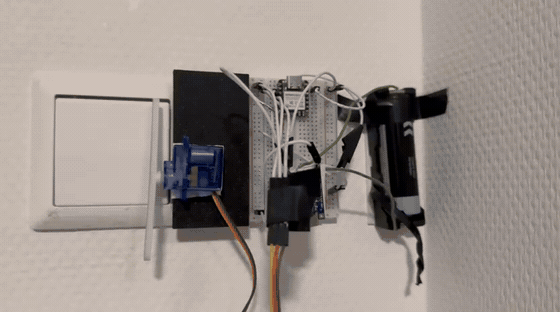
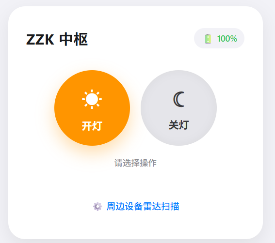
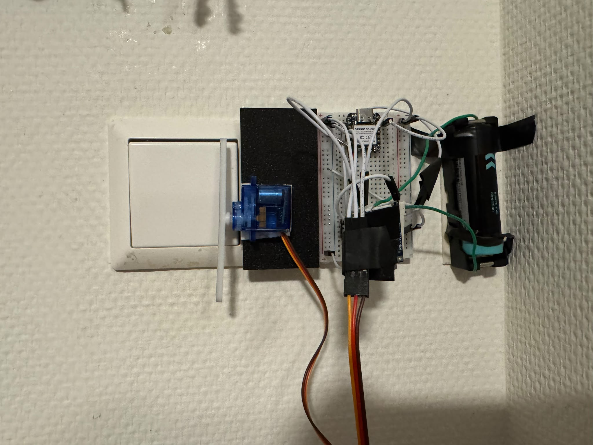
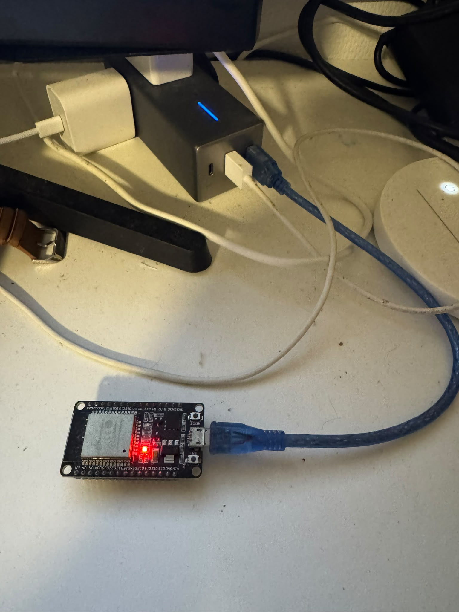
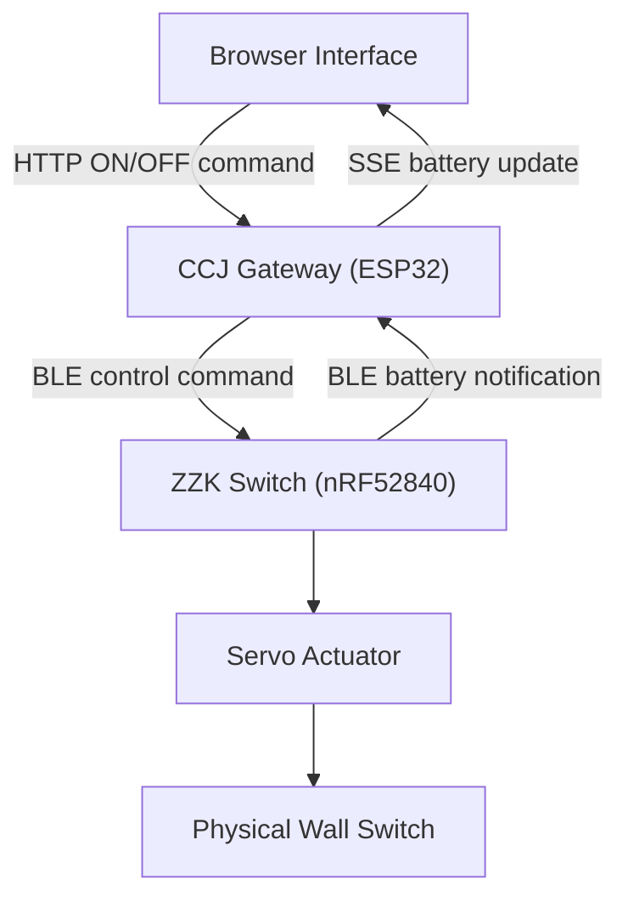
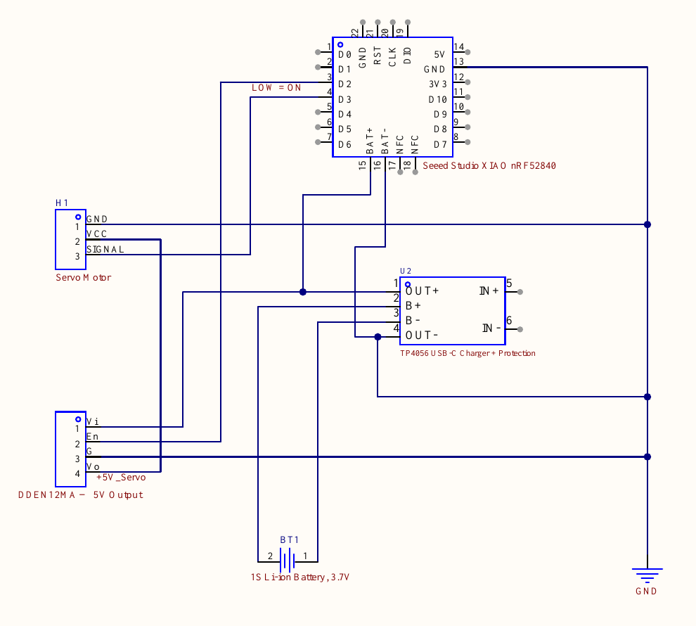

# ZZK-SA2 -- BLE Switch Assistant

Turn off the lights without leaving your warm bed.
A battery-powered BLE actuator that uses a servo to press an existing wall switch, with a focus on low-power operation and flexible integration.

## Project Status
ZZK-SA2 is an experimental DIY project under active development. You may need to adapt the firmware, wiring, or mechanical setup to make it work with your hardware and wall switch.

## Introduction

ZZK-SA2 is built around the Seeed Studio XIAO nRF52840. It receives commands over Bluetooth Low Energy (BLE) and drives a servo to physically press a wall switch, enabling remote lighting control without modifying the room's existing electrical wiring.
In a shared student dorm, turning off the lights can mean climbing down from the top bunk. Even in a private apartment, the only light switch may be next to the door. ZZK-SA2 was created to solve this small but familiar inconvenience.
The device exposes a custom BLE GATT interface and is independent of any particular home automation platform. Integration options include:
- Home Assistant via ESPHome: use an ESP32 running ESPHome as a BLE gateway, configured to communicate with ZZK-SA2's GATT characteristics.
- CCJ Gateway: use the companion [CCJ Gateway repository](https://github.com/coauther/CCJ-Gateway) project to control the switch through a web interface.
- Other BLE clients: use a device or app that can write the required commands to the switch's control characteristic.

### Why the Name ZZK?
ZZK is the roommate of CCJ, one of the project's authors. Since ZZK usually goes to bed later, the nightly duty of turning off the lights naturally fell to him. The ZZK Switch Assistant took over that job—and inherited his name. 

### What Happened to ZZK-SA1?
The first-generation design used an ESP32 with ESP-NOW for communication and control. In our prototype tests, integrating this approach with other systems proved less convenient, and achieving acceptable battery life was difficult. We retired that design and moved to the nRF52840-based BLE architecture used in ZZK-SA2.

### Why ZZK-SA2?
- Designed for battery operation: the servo and 5 V boost converter are enabled only during actuation to reduce idle power consumption.
- Flexible integration: a custom GATT interface over standard BLE allows compatible gateways and apps to control the device.
- No changes to room wiring: a servo operates the existing wall switch mechanically.
- Simple, focused design: a small set of modules and a straightforward control sequence make the project easier to understand, reproduce, and adapt.

## Real-World Demonstration

The prototype is installed on an existing wall switch and uses a servo to operate it without modifying the room's electrical wiring.

### See It in Action

The demonstration below shows the actuator turning the room light off and back on.

[Watch or download the full video](docs/switch-demo.mp4)

### Web Control Interface

CCJ Gateway provides a browser-based interface for controlling ZZK-SA2 and displaying its estimated battery level.

The prototype interface is shown in Chinese:

- **开灯 / 关灯:** send ON / OFF commands to the switch.
- **Battery indicator:** displays the battery percentage reported by the switch.
- **周边设备雷达扫描:** scans for nearby BLE devices.

Access the interface through the gateway's local IP address from a device on the same local network.

### Switch Prototype

The photo below shows the assembled switch node, including its wiring and mechanical arrangement.

This is a functional prototype assembled from separate modules. The wiring prioritizes testing and easy modification; for reproduction, refer to the [wiring schematic](docs/wiring-schematic.pdf) alongside the photo.

### Companion Gateway

The ESP32-based CCJ Gateway connects the browser interface to the BLE switch node, forwarding control commands and battery updates.

Gateway firmware and setup details are available in the [CCJ Gateway repository](https://github.com/coauther/CCJ-Gateway).

## System Architecture

The system uses the CCJ Gateway as a communication bridge between the browser-based user interface and the battery-powered ZZK Switch.

The system contains two main data flows:

1. **Light control:** The browser sends an HTTP request to the CCJ Gateway. The gateway converts the request into a one-byte BLE command and transmits it to the ZZK Switch, which then operates the servo motor.

2. **Battery monitoring:** The ZZK Switch measures its battery voltage through the ADC and periodically sends the estimated battery percentage through a BLE notification. The CCJ Gateway forwards the latest value to the browser using Server-Sent Events (SSE).

## Hardware and Software

| Category | Component or Technology |
|---|---|
| Development board | Seeed Studio XIAO nRF52840 |
| Programming language | C++ |
| Development framework | Arduino framework |
| Wireless communication | Bluetooth Low Energy (BLE) |
| BLE role | Peripheral |
| Mechanical actuator | Servo motor |
| Servo power supply | eletechsup DDEN12MA boost converter, fixed 5 V version |
| Battery charging and protection | TP4056 USB-C charging module with Li-ion protection |
| Battery measurement | 10-bit ADC |
| Power source | Single-cell 3.7 V Li-ion battery |
| Companion device | uPesy ESP32 Wroom DevKit |

### Wiring Schematic

The schematic below shows the connections between the XIAO nRF52840, battery charging and protection module, boost converter, and servo.

Click the image to open the full schematic, or [download the PDF](docs/wiring-schematic.pdf).

- **D2 → EN:** enables the boost converter during servo operation. (LOW enables the boost converter; HIGH disables it.)
- **D3 → SIGNAL:** provides the servo control signal.
- **Boost converter Vo → Servo VCC:** supplies 5 V to the servo.

### Main Software Libraries

- `bluefruit` for BLE services, characteristics, and advertising
- `Servo` for servo motor position control
- Arduino ADC functions for battery-voltage measurement

## Current Limitations

- Servo angles and mounting geometry must be adjusted for the target wall switch.
- Battery percentage is estimated from ADC readings using a simple linear mapping.
- The device does not sense the actual light state; sending a command does not confirm that the wall switch was successfully operated.